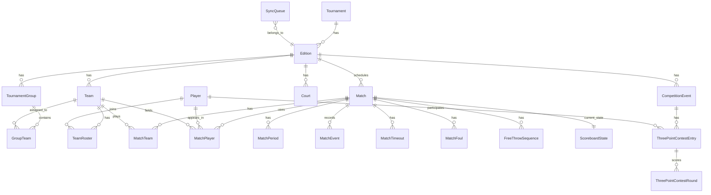

# Diagramma E/R - Piazzetta Madness

```mermaid
erDiagram
    Tournament ||--o{ Edition : has
    Edition ||--o{ Team : has
    Edition ||--o{ TournamentGroup : has
    Edition ||--o{ Match : schedules
    Edition ||--o{ Court : has
    Edition ||--o{ CompetitionEvent : has

    TournamentGroup ||--o{ GroupTeam : contains
    Team ||--o{ GroupTeam : assigned_to

    Team ||--o{ TeamRoster : has
    Player ||--o{ TeamRoster : joins

    Match ||--o{ MatchTeam : has
    Team ||--o{ MatchTeam : plays
    Match ||--o{ MatchPlayer : uses
    Player ||--o{ MatchPlayer : appears_in
    Team ||--o{ MatchPlayer : fields

    Match ||--o{ MatchPeriod : has
    Match ||--o{ MatchEvent : records
    Match ||--o{ MatchTimeout : has
    Match ||--o{ MatchFoul : has
    Match ||--o{ FreeThrowSequence : has
    Match ||--|| ScoreboardState : current_state

    CompetitionEvent ||--o{ ThreePointContestEntry : has
    Player ||--o{ ThreePointContestEntry : participates
    ThreePointContestEntry ||--o{ ThreePointContestRound : scores

    SyncQueue }o--|| Edition : belongs_to
```
