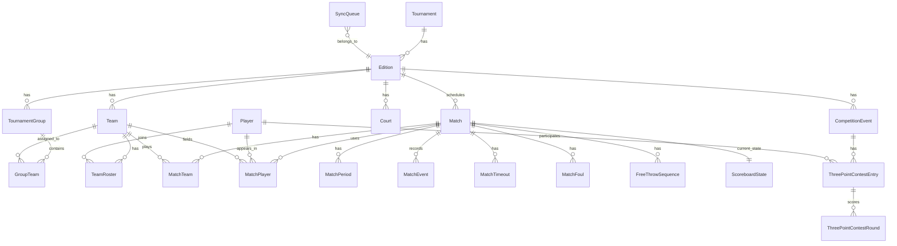

# Modello E/R - Piazzetta Madness

Versione: 0.1

Questo documento descrive il modello dati iniziale per gestire torneo, squadre, giocatori, partite, tabellone live, statistiche e sincronizzazione online.

Le regole base considerate derivano dal regolamento 2025, ignorando le date specifiche:

- 8 squadre divise in 2 gironi da 4.
- Ogni squadra gioca 3 partite di girone.
- Passano alle semifinali le prime 2 squadre di ogni girone.
- Partite da 2 tempi da 12 minuti a tempo continuato.
- Cronometro fermato solo sui tiri liberi.
- Intervallo da 2 minuti.
- Timeout: 2 per squadra, uno per tempo, da 30 secondi.
- Limite 45 punti in fase gironi, non applicato in semifinali e finali.
- Supplementare gironi: 2 minuti secco, poi tiro libero sudden death.
- Supplementari fasi finali: 2 minuti fino a determinare una vincente.
- Falli personali: 5 falli = espulsione.
- Bonus squadra: dal quinto fallo, 2 tiri liberi.
- Infrazioni FIBA incluse 3, 5, 8 e 24 secondi.
- Valore canestri: 1 libero, 2 dentro arco, 3 fuori arco.

## Vista Generale



## Anagrafiche Torneo

### Tournament

Torneo generale, per esempio "Piazzetta Madness".

| Campo | Tipo | Note |
| --- | --- | --- |
| Id | Guid/int | Chiave primaria |
| Name | string | Nome torneo |
| Description | string? | Descrizione |
| CreatedAt | datetime | Creazione |
| UpdatedAt | datetime | Ultima modifica |

Relazioni:

- `Tournament 1 -> N Edition`

### Edition

Singola edizione annuale del torneo.

| Campo | Tipo | Note |
| --- | --- | --- |
| Id | Guid/int | Chiave primaria |
| TournamentId | FK | Torneo |
| Name | string | Es. "Piazzetta Madness 2026" |
| Year | int | Anno edizione |
| StartDate | date? | Data inizio |
| EndDate | date? | Data fine |
| Status | EditionStatus | Draft, Active, Completed, Cancelled |
| CreatedAt | datetime | Creazione |
| UpdatedAt | datetime | Ultima modifica |

### Court

Campo o luogo partita.

| Campo | Tipo | Note |
| --- | --- | --- |
| Id | Guid/int | Chiave primaria |
| EditionId | FK | Edizione |
| Name | string | Es. "Piazzetta Verde" |
| Location | string? | Indirizzo o descrizione |

## Squadre E Giocatori

### Team

Squadra iscritta a una edizione.

| Campo | Tipo | Note |
| --- | --- | --- |
| Id | Guid/int | Chiave primaria |
| EditionId | FK | Edizione |
| Name | string | Nome completo |
| ShortName | string? | Nome breve per tabellone |
| PrimaryColor | string? | Hex colore principale |
| SecondaryColor | string? | Hex colore secondario |
| LogoPath | string? | Percorso logo locale |
| CreatedAt | datetime | Creazione |
| UpdatedAt | datetime | Ultima modifica |

Relazioni:

- `Edition 1 -> N Team`
- `Team 1 -> N TeamRoster`
- `Team 1 -> N MatchTeam`
- `Team 1 -> N MatchPlayer`

### Player

Anagrafica globale del giocatore.

| Campo | Tipo | Note |
| --- | --- | --- |
| Id | Guid/int | Chiave primaria |
| FirstName | string | Nome |
| LastName | string | Cognome |
| Nickname | string? | Soprannome |
| BirthDate | date? | Data nascita |
| PhotoPath | string? | Foto locale |
| CreatedAt | datetime | Creazione |
| UpdatedAt | datetime | Ultima modifica |

Nota: il giocatore resta separato dalla squadra per poterlo riusare in edizioni successive.

### TeamRoster

Associazione giocatore-squadra per una edizione.

| Campo | Tipo | Note |
| --- | --- | --- |
| Id | Guid/int | Chiave primaria |
| TeamId | FK | Squadra |
| PlayerId | FK | Giocatore |
| JerseyNumber | int? | Numero maglia |
| Role | string? | Es. Player, Coach |
| IsCaptain | bool | Capitano |
| IsActive | bool | Nel roster valido |
| CreatedAt | datetime | Creazione |
| UpdatedAt | datetime | Ultima modifica |

Vincoli consigliati:

- un giocatore non dovrebbe comparire due volte nello stesso roster squadra;
- il numero maglia dovrebbe essere unico dentro la squadra, se valorizzato.

## Gironi E Classifiche

### TournamentGroup

Girone della fase iniziale.

| Campo | Tipo | Note |
| --- | --- | --- |
| Id | Guid/int | Chiave primaria |
| EditionId | FK | Edizione |
| Name | string | Es. "Girone A" |
| Code | string | Es. "A" |
| SortOrder | int | Ordinamento |

### GroupTeam

Squadra assegnata a un girone.

| Campo | Tipo | Note |
| --- | --- | --- |
| Id | Guid/int | Chiave primaria |
| GroupId | FK | Girone |
| TeamId | FK | Squadra |
| SeedLabel | string? | Es. A1, A2, B3 |

### Standing

Classifica calcolata o materializzata per un girone.

| Campo | Tipo | Note |
| --- | --- | --- |
| Id | Guid/int | Chiave primaria |
| GroupId | FK | Girone |
| TeamId | FK | Squadra |
| Played | int | Partite giocate |
| Wins | int | Vittorie |
| Losses | int | Sconfitte |
| PointsFor | int | Punti fatti |
| PointsAgainst | int | Punti subiti |
| PointDifference | int | Differenza canestri |
| RankingPoints | int | Punti classifica, se usati |
| Position | int? | Posizione finale |
| TieBreakNote | string? | Motivo ordinamento in parita |

Nota: puo essere una tabella aggiornata a fine partita oppure una vista calcolata. Per la prima versione conviene calcolarla dal risultato delle partite e salvarla solo quando si chiude il girone.

Tie-break gironi:

1. scontro diretto;
2. differenza canestri;
3. punti fatti;
4. sorteggio.

## Partite

### Match

Partita schedulata o giocata.

| Campo | Tipo | Note |
| --- | --- | --- |
| Id | Guid/int | Chiave primaria |
| EditionId | FK | Edizione |
| GroupId | FK? | Solo per fase gironi |
| CourtId | FK? | Campo |
| Name | string? | Nome libero |
| Phase | MatchPhase | GroupStage, SemiFinal, ThirdPlaceFinal, Final |
| Round | string? | Es. "Giornata 1" |
| ScheduledStartAt | datetime? | Ora inizio prevista |
| ScheduledEndAt | datetime? | Ora fine prevista |
| ActualStartAt | datetime? | Ora inizio reale |
| ActualEndAt | datetime? | Ora fine reale |
| Status | MatchStatus | Scheduled, Ready, Live, Paused, Finished, Cancelled |
| PeriodCount | int | Default 2 |
| PeriodDurationSeconds | int | Default 720 |
| BreakDurationSeconds | int | Default 120 |
| OvertimeDurationSeconds | int | Default 120 |
| ShotClockSeconds | int | Default 24 |
| TimeoutDurationSeconds | int | Default 30 |
| TimeoutsPerTeam | int | Default 2 |
| TimeoutsPerPeriod | int | Default 1 |
| PersonalFoulLimit | int | Default 5 |
| TeamFoulBonusThreshold | int | Default 5 |
| MaxScore | int? | Default 45 per gironi |
| MaxScoreEnabled | bool | False per fasi finali |
| StopClockOnFreeThrows | bool | True |
| WinnerTeamId | FK? | Vincitore |
| WinReason | WinReason? | Regular, MaxScoreReached, Overtime, SuddenDeathFreeThrow, Forfeit, Disqualification, Abandoned |
| Notes | string? | Note organizzative |
| CreatedAt | datetime | Creazione |
| UpdatedAt | datetime | Ultima modifica |

### MatchTeam

Squadra partecipante alla partita.

| Campo | Tipo | Note |
| --- | --- | --- |
| Id | Guid/int | Chiave primaria |
| MatchId | FK | Partita |
| TeamId | FK | Squadra |
| Side | TeamSide | Home, Away |
| Score | int | Punteggio corrente/finale |
| FoulsCurrentPeriod | int | Falli squadra nel periodo corrente |
| TimeoutsUsedTotal | int | Timeout usati |
| TimeoutsUsedPeriod | int | Timeout usati nel periodo corrente |
| IsWinner | bool | Vincitrice |
| ForfeitScore | int? | Punteggio assegnato a tavolino |

Vincoli consigliati:

- una partita deve avere 2 record `MatchTeam`;
- `Side` unico per partita.

### MatchPlayer

Giocatore disponibile o usato in una specifica partita.

| Campo | Tipo | Note |
| --- | --- | --- |
| Id | Guid/int | Chiave primaria |
| MatchId | FK | Partita |
| TeamId | FK | Squadra |
| PlayerId | FK | Giocatore |
| JerseyNumber | int? | Numero in questa partita |
| IsStartingFive | bool | In quintetto iniziale |
| IsOnCourt | bool | In campo |
| Points | int | Punti |
| PersonalFouls | int | Falli personali |
| IsFouledOut | bool | Espulso per falli |
| IsEjected | bool | Espulso disciplinarmente |

Nota: questa tabella fotografa il roster della partita, anche se il roster squadra cambia in futuro.

### MatchPeriod

Periodo di gioco, inclusi supplementari.

| Campo | Tipo | Note |
| --- | --- | --- |
| Id | Guid/int | Chiave primaria |
| MatchId | FK | Partita |
| PeriodNumber | int | 1, 2, 3... |
| PeriodType | PeriodType | Regular, Overtime, SuddenDeath |
| DurationSeconds | int | Durata prevista |
| StartedAt | datetime? | Inizio reale |
| EndedAt | datetime? | Fine reale |
| HomeScoreStart | int | Punteggio home a inizio periodo |
| AwayScoreStart | int | Punteggio away a inizio periodo |
| HomeScoreEnd | int? | Punteggio home a fine periodo |
| AwayScoreEnd | int? | Punteggio away a fine periodo |

## Live Match E Tabellone

### ScoreboardState

Stato corrente della partita. Serve per persistenza, ripresa dopo crash e sincronizzazione live.

Durante il gioco lo stato piu importante deve restare in memoria, non letto dal database a ogni tick.

| Campo | Tipo | Note |
| --- | --- | --- |
| Id | Guid/int | Chiave primaria |
| MatchId | FK unique | Partita |
| CurrentPeriod | int | Periodo attuale |
| CurrentPeriodType | PeriodType | Regular, Overtime, SuddenDeath |
| GameClockSecondsRemaining | decimal/int | Tempo gara rimanente |
| ShotClockSecondsRemaining | decimal/int | 24 secondi rimanenti |
| TimeoutClockSecondsRemaining | decimal/int? | Timeout in corso |
| BreakClockSecondsRemaining | decimal/int? | Intervallo in corso |
| IsGameClockRunning | bool | Cronometro gara attivo |
| IsShotClockRunning | bool | Cronometro 24 attivo |
| IsTimeoutRunning | bool | Timeout attivo |
| IsBreakRunning | bool | Intervallo attivo |
| PossessionTeamId | FK? | Squadra in possesso |
| HomeScore | int | Punteggio home |
| AwayScore | int | Punteggio away |
| HomeFoulsCurrentPeriod | int | Falli squadra home |
| AwayFoulsCurrentPeriod | int | Falli squadra away |
| HomeTimeoutsUsedTotal | int | Timeout usati home |
| AwayTimeoutsUsedTotal | int | Timeout usati away |
| LastEventId | FK? | Ultimo evento applicato |
| LastUpdatedAt | datetime | Ultimo aggiornamento |

Nota tecnica:

- per i cronometri conviene salvare secondi con decimali oppure millisecondi interi;
- per il rendering live, la UI dovrebbe ricevere aggiornamenti dallo stato in memoria;
- il database salva snapshot ed eventi, ma non deve guidare il disegno frame-per-frame del tabellone.

### MatchEvent

Registro eventi della partita. E la tabella piu importante per storico, live online, undo e statistiche.

| Campo | Tipo | Note |
| --- | --- | --- |
| Id | Guid/int | Chiave primaria |
| MatchId | FK | Partita |
| Period | int | Periodo |
| PeriodType | PeriodType | Regular, Overtime, SuddenDeath |
| GameClockSecondsRemaining | decimal/int | Tempo gara al momento evento |
| ShotClockSecondsRemaining | decimal/int? | 24 secondi al momento evento |
| TeamId | FK? | Squadra coinvolta |
| PlayerId | FK? | Giocatore coinvolto |
| EventType | MatchEventType | Tipo evento |
| Points | int? | Punti dell'evento |
| IsCorrection | bool | Evento di correzione |
| RevertsEventId | FK? | Evento annullato |
| Description | string? | Nota testuale |
| PayloadJson | string? | Dettagli flessibili |
| CreatedAt | datetime | Creazione locale |
| SyncedAt | datetime? | Sincronizzato online |

Eventi consigliati:

- GameStarted
- GamePaused
- GameResumed
- GameEnded
- PeriodStarted
- PeriodEnded
- OvertimeStarted
- Score1
- Score2
- Score3
- ScoreCorrection
- FoulPersonal
- FoulTechnical
- FoulUnsportsmanlike
- PlayerFouledOut
- PlayerEjected
- TeamBonusReached
- TimeoutStarted
- TimeoutEnded
- FreeThrowStarted
- FreeThrowMade
- FreeThrowMissed
- ShotClockReset24
- ShotClockReset14
- ShotClockViolation
- PossessionChanged
- JumpBall
- ForfeitAssigned
- ManualNote

Nota: anche se nel regolamento si parla di 24 secondi, si lascia `ShotClockReset14` per compatibilita con regole FIBA o future modifiche.

### MatchTimeout

Timeout richiesti durante la partita.

| Campo | Tipo | Note |
| --- | --- | --- |
| Id | Guid/int | Chiave primaria |
| MatchId | FK | Partita |
| TeamId | FK | Squadra |
| Period | int | Periodo |
| RequestedByPlayerId | FK? | Giocatore richiedente |
| RequestedByCoachName | string? | Coach, se non anagrafato |
| DurationSeconds | int | Default 30 |
| StartedAt | datetime | Inizio |
| EndedAt | datetime? | Fine |

### MatchFoul

Fallo assegnato.

| Campo | Tipo | Note |
| --- | --- | --- |
| Id | Guid/int | Chiave primaria |
| MatchId | FK | Partita |
| TeamId | FK | Squadra |
| PlayerId | FK? | Giocatore |
| Period | int | Periodo |
| GameClockSecondsRemaining | decimal/int | Tempo gara |
| FoulType | FoulType | Personal, Technical, Unsportsmanlike, Disqualifying |
| CountsAsTeamFoul | bool | Conta nel bonus squadra |
| FreeThrowsAwarded | int | Liberi assegnati |
| CreatedEventId | FK? | Evento collegato |

### FreeThrowSequence

Sequenza di tiri liberi. Utile per fermare il cronometro, gestire bonus e statistiche.

| Campo | Tipo | Note |
| --- | --- | --- |
| Id | Guid/int | Chiave primaria |
| MatchId | FK | Partita |
| TeamId | FK | Squadra che tira |
| PlayerId | FK? | Tiratore |
| Period | int | Periodo |
| AwardedShots | int | Liberi concessi |
| MadeShots | int | Liberi segnati |
| Reason | FreeThrowReason | Foul, Bonus, Technical, SuddenDeath |
| StartedAt | datetime | Inizio |
| EndedAt | datetime? | Fine |

## Risultati Speciali

### ForfeitResult

Risultato a tavolino o interruzione disciplinare.

| Campo | Tipo | Note |
| --- | --- | --- |
| Id | Guid/int | Chiave primaria |
| MatchId | FK unique | Partita |
| WinningTeamId | FK? | Vincitrice |
| LosingTeamId | FK? | Perdente |
| HomeAssignedScore | int | Default possibile 20 |
| AwayAssignedScore | int | Default possibile 0 |
| Reason | ForfeitReason | NotEnoughPlayers, Abandonment, Disqualification, WeatherDecision, OrganizerDecision |
| Notes | string? | Dettaglio |
| CreatedAt | datetime | Creazione |

## 3 Point Contest

Il 3 Point Contest e modellato come evento separato, non come partita.

### CompetitionEvent

Evento speciale dentro una edizione.

| Campo | Tipo | Note |
| --- | --- | --- |
| Id | Guid/int | Chiave primaria |
| EditionId | FK | Edizione |
| EventType | CompetitionEventType | ThreePointContest, AwardCeremony, Other |
| Name | string | Nome evento |
| ScheduledStartAt | datetime? | Inizio previsto |
| ScheduledEndAt | datetime? | Fine prevista |
| Status | EventStatus | Scheduled, Live, Completed, Cancelled |

### ThreePointContestEntry

Partecipante alla gara da 3 punti.

| Campo | Tipo | Note |
| --- | --- | --- |
| Id | Guid/int | Chiave primaria |
| CompetitionEventId | FK | Evento |
| TeamId | FK | Squadra |
| PlayerId | FK | Giocatore |
| SeedOrder | int? | Ordine di tiro |
| TotalScore | int | Punteggio totale |
| FinalPosition | int? | Classifica |

Vincoli consigliati:

- massimo un partecipante per squadra, salvo cambio regolamento.

### ThreePointContestRound

Singolo turno o spareggio.

| Campo | Tipo | Note |
| --- | --- | --- |
| Id | Guid/int | Chiave primaria |
| EntryId | FK | Partecipante |
| RoundNumber | int | 1, 2... |
| RoundType | ThreePointRoundType | Qualification, Final, TieBreak |
| Station1Score | int | Punti postazione 1 |
| Station2Score | int | Punti postazione 2 |
| Station3Score | int | Punti postazione 3 |
| Station4Score | int | Punti postazione 4 |
| Station5Score | int | Punti postazione 5 |
| TotalScore | int | Totale turno |
| Notes | string? | Note |

## Sincronizzazione Online

### SyncQueue

Coda locale per inviare dati verso server o database online.

| Campo | Tipo | Note |
| --- | --- | --- |
| Id | Guid/int | Chiave primaria |
| EditionId | FK? | Edizione |
| EntityType | string | Es. MatchEvent, Match, Team |
| EntityId | string | Id entita locale |
| Operation | SyncOperation | Create, Update, Delete, Snapshot |
| PayloadJson | string | Dati da inviare |
| Status | SyncStatus | Pending, Sending, Sent, Failed |
| RetryCount | int | Tentativi |
| LastError | string? | Ultimo errore |
| CreatedAt | datetime | Creazione |
| SentAt | datetime? | Invio riuscito |

Regola consigliata:

- durante la partita il software deve funzionare anche offline;
- ogni evento live viene salvato localmente e messo in coda;
- la sync online e asincrona e non deve bloccare cronometro o tabellone.

## Enum Principali

```text
EditionStatus:
- Draft
- Active
- Completed
- Cancelled

MatchPhase:
- GroupStage
- SemiFinal
- ThirdPlaceFinal
- Final

MatchStatus:
- Scheduled
- Ready
- Live
- Paused
- Finished
- Cancelled

TeamSide:
- Home
- Away

PeriodType:
- Regular
- Overtime
- SuddenDeath

WinReason:
- Regular
- MaxScoreReached
- Overtime
- SuddenDeathFreeThrow
- Forfeit
- Disqualification
- Abandoned

FoulType:
- Personal
- Technical
- Unsportsmanlike
- Disqualifying

FreeThrowReason:
- Foul
- Bonus
- Technical
- SuddenDeath

CompetitionEventType:
- ThreePointContest
- AwardCeremony
- Other

EventStatus:
- Scheduled
- Live
- Completed
- Cancelled

SyncOperation:
- Create
- Update
- Delete
- Snapshot

SyncStatus:
- Pending
- Sending
- Sent
- Failed
```

## Note Di Progettazione

### Stato live e database

Il database non deve essere il motore realtime del tabellone.

Flusso consigliato:

```text
Console operatore
  -> stato partita in memoria
  -> finestre tabellone
  -> MatchEvent su SQLite
  -> ScoreboardState snapshot
  -> SyncQueue online
```

### Undo e correzioni

Per evitare dati incoerenti:

- non cancellare eventi live gia creati;
- usare eventi di correzione con `IsCorrection = true`;
- collegare l'evento corretto tramite `RevertsEventId`;
- ricalcolare punteggi e statistiche applicando la sequenza eventi.

### Campi temporali

Per i cronometri conviene usare millisecondi interi nel codice e nel database:

```text
GameClockMillisecondsRemaining
ShotClockMillisecondsRemaining
```

Nel documento sono indicati come secondi per leggibilita, ma in implementazione useremo millisecondi.

### Regole configurabili

Molte regole sono salvate dentro `Match` per poter gestire eccezioni future:

- durata tempi;
- durata supplementari;
- 24 secondi;
- limite 45 punti;
- timeout;
- limite falli personali;
- soglia bonus squadra.

Questo permette di cambiare una singola partita senza modificare l'intero programma.

